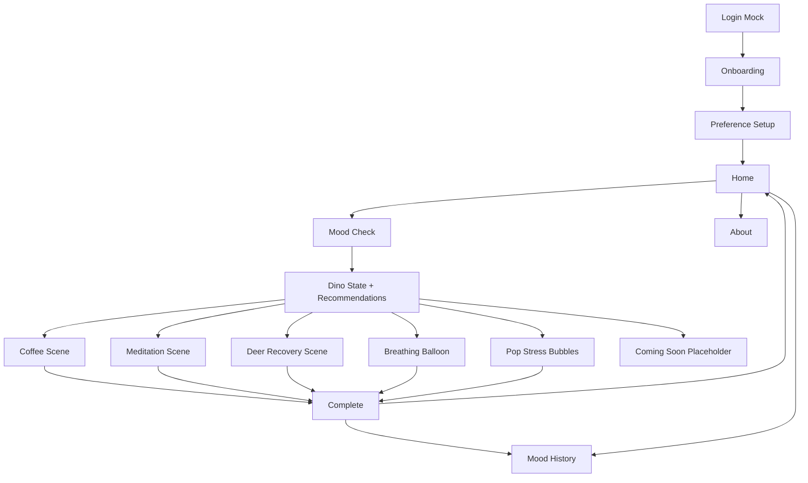
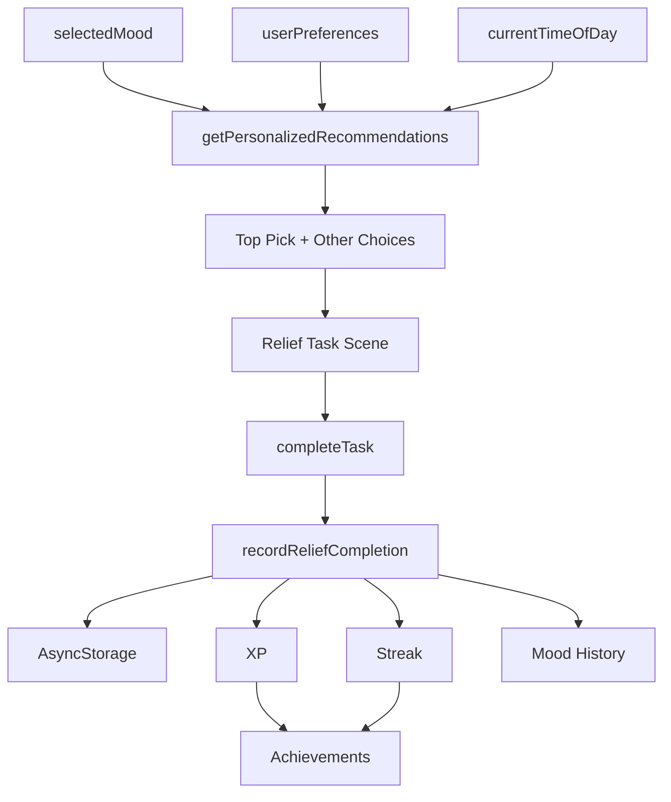

# Dino Calm Project Handoff

更新时间：2026-05-21  
项目路径：`/Users/nukeab/Documents/dino-calm`  
当前目标版本：MVP 2.4.0

## 项目定位

Dino Calm / 小恐龙松一口气 是一个 Expo + React Native + TypeScript 的单页情绪陪伴 App。

核心方向：
- 记录用户每日心情和压力状态
- 根据用户偏好、当前心情、压力高发时间推荐解压方式
- 小恐龙和小鹿通过温柔动画陪用户完成解压
- 轻游戏化成长系统：XP、Streak、等级、饰品、成就
- 不是医疗产品，不提供诊断、治疗或心理治疗承诺

设计风格：
- 温柔、治愈、可爱、低压力
- 中英双语文案
- 卡片式单页状态流
- 使用轻量动画，不追求高刺激反馈

## 技术栈与约束

- Expo SDK 54
- React Native 0.81
- React 19
- TypeScript strict mode
- AsyncStorage 本地持久化
- `react-native-safe-area-context`
- `expo-notifications`
- 动画只使用 React Native `Animated`
- 无后端
- 无真实登录，只有 mock login
- 单页状态流，不使用复杂路由

重要项目指令：
- 写代码前必须参考 Expo SDK 54 文档：`https://docs.expo.dev/versions/v54.0.0/`
- 安装 Expo 相关依赖使用 `npx expo install`
- 不要破坏现有 XP / Streak / Mood History 规则

## 核心数据与规则

### AsyncStorage Keys

```ts
const STORAGE_KEYS = {
  hasLoggedIn: 'dino-calm-has-logged-in',
  hasSeenOnboarding: 'dino-calm-has-seen-onboarding',
  hasCompletedPreferenceSetup: 'dino-calm-has-completed-preference-setup',
  userPreferences: 'dino-calm-user-preferences',
  xp: 'dino-calm-xp',
  streak: 'dino-calm-streak',
  lastCompletedDate: 'dino-calm-last-completed-date',
  moodHistory: 'dino-calm-mood-history',
  achievements: 'dino-calm-achievements',
};
```

### 奖励规则

必须保持：
- 当天第一次完成任意解压方式：`+10 XP`，`Streak +1`
- 当天后续完成任意解压方式：`+5 XP`
- Streak 每天最多增加一次
- XP 可以一天内多次增加
- Mood History 只记录当天第一次正式完成
- Mood History 记录 `reliefMethod`、`recommendationSource`、`wasTopPick`

### Mood 系统

支持的 mood：
- `Happy`
- `Calm`
- `Tired`
- `Anxious`
- `Angry`
- `Sad`

Dino 状态：
- `calm`
- `happy`
- `grumpy`
- `healing`

### 用户偏好

```ts
type UserPreferences = {
  favoriteReliefMethods: FavoriteReliefMethod[];
  reminderTime?: string;
  supportStyle: SupportStyle;
  stressTime: StressTime;
};
```

默认值：
```ts
{
  favoriteReliefMethods: ['coffee', 'meditation', 'recovery'],
  reminderTime: '20:00',
  supportStyle: 'encouragement',
  stressTime: 'evening',
}
```

## 当前已完成部分

### MVP 2.1 基础

已具备：
- Login Mock
- Onboarding
- Preference Setup
- Home
- Mood Check
- Dino State
- Personalized Recommendation
- Coffee with Dino
- Recovery Training with Deer
- Meditation with Dino
- Breathing Balloon
- Pop Stress Bubbles
- Complete
- Mood History
- About

### MVP 2.2

已完成：
- `getPersonalizedRecommendations()`
- `recordReliefCompletion()`
- Top Pick UI
- Top Pick 完成后展示 `Dino picked this for you today.`
- 占位解压方式文案：`Coming soon. For now, try breathing instead.`
- `expo-notifications` 本地提醒基础
- 完成行为写入 AsyncStorage
- Mood History 写入 `recommendationSource: "personalized"` 和 `wasTopPick`

### MVP 2.3

已完成：
- 用户可选提醒时间：`09:00` / `15:00` / `20:00` / `22:00`
- 未完成 Daily Check-in 时调度本地通知
- Web 平台自动跳过本地通知调度
- 成就系统
- 成就 AsyncStorage key：`dino-calm-achievements`
- 成就示例：
  - `3天连续放松`
  - `100 XP累计`
  - `7天稳定陪伴`
  - `250 XP累计`
- 首页成就面板
- 完成页新成就提示
- 页面切换轻微淡入上滑动画
- Coffee / Meditation / Recovery 基础动画增强

### MVP 2.4

已完成：
- 新增独立场景组件：
  - `components/coffee-scene.tsx`
  - `components/meditation-scene.tsx`
  - `components/deer-recovery-scene.tsx`
- `App.tsx` 改为调用这些场景组件
- Coffee 动画增强：
  - 小恐龙眨眼
  - 呼吸浮动
  - 举杯/手臂动作
  - 咖啡热气上升
  - 杯子轻微缩放
  - 高光闪烁
  - 1-30 秒倒计时显示
- Meditation 动画增强：
  - 呼吸光圈循环缩放
  - 小恐龙打坐浮动
  - 1 / 3 / 5 分钟选择
  - 计时状态呼吸反馈
- Deer Recovery 动画增强：
  - Idle 轻微浮动
  - 指导状态左右动作
  - 完成状态 bounce
  - 每步 10 秒
  - Next Step / Complete 保持原奖励逻辑
- 版本号更新到 `2.4.0`
  - `package.json`
  - `package-lock.json`
  - `app.json`

## 重要文件修改记录

### `App.tsx`

职责：
- 单页状态机主入口
- 管理登录、引导、偏好、主页、心情选择、推荐、任务、完成、历史、关于等页面状态
- 持有核心 app state：
  - currentStep
  - selectedMood
  - userPreferences
  - xp
  - streak
  - lastCompletedDate
  - moodHistory
  - unlockedAchievementIds
  - task-specific timer / progress state
- 调用：
  - `getPersonalizedRecommendations()`
  - `recordReliefCompletion()`
  - `DailyReminder`
  - `AchievementList`
  - `CoffeeScene`
  - `MeditationScene`
  - `DeerRecoveryScene`

注意：
- `completeTask()` 是奖励和 Mood History 的关键入口
- 不要绕过 `completeTask()` 直接改 XP / Streak
- 不要改变当天第一次完成和后续完成的奖励规则

### `components/recommendations.ts`

职责：
- 类型定义：
  - `MoodValue`
  - `FavoriteReliefMethod`
  - `SupportStyle`
  - `StressTime`
  - `RecoveryType`
  - `TaskKind`
  - `RecommendationTask`
  - `UserPreferences`
  - `HistoryItem`
  - `PersonalizedRecommendation`
- 推荐逻辑：
  - `getPersonalizedRecommendations()`
- 完成记录：
  - `recordReliefCompletion()`

推荐依据：
- 当前 mood
- 用户喜欢的解压方式
- 当前时间段是否命中压力高发时间
- 保底加入 breathing / bubbles

### `components/daily-reminder.tsx`

职责：
- Expo Notifications handler
- 根据用户自定义提醒时间调度通知
- 当天已完成时取消或不调度提醒
- Web 平台跳过通知

示例提醒文案：
- `小恐龙想你啦，要不要喝咖啡？`
- `今天压力有点大，小恐龙建议做冥想`
- `小恐龙在这里，今天要不要一起做一次轻轻呼吸？`

### `components/achievements.tsx`

职责：
- 成就定义
- 成就解锁判断
- 成就饰品映射
- 成就列表 UI

当前成就：
- `streak-3`
- `xp-100`
- `streak-7`
- `xp-250`

### `components/coffee-scene.tsx`

职责：
- Coffee with Dino 场景 UI 与动画
- 内部管理眨眼、呼吸、热气、杯子高光、手臂动作
- 接收外部回调：
  - `onStart`
  - `onPause`
  - `onComplete`
  - `onBack`

注意：
- `onComplete` 由 `App.tsx` 传入，最终调用 `completeTask('coffee')`
- 不在组件内部直接修改 XP / Streak

### `components/meditation-scene.tsx`

职责：
- Meditation with Dino 场景 UI 与动画
- 呼吸光圈、打坐浮动、计时显示、时长选择
- 接收外部回调：
  - `onSelectMinutes`
  - `onStart`
  - `onPause`
  - `onReset`
  - `onComplete`
  - `onBack`

注意：
- `onComplete` 由 `App.tsx` 传入，最终调用 `completeTask('meditation')`

### `components/deer-recovery-scene.tsx`

职责：
- Recovery Training with Deer 场景 UI 与动画
- 小鹿 idle / guiding / happy 动作
- 训练列表、步骤显示、10 秒计时显示
- 接收外部回调：
  - `onSelectTraining`
  - `onStart`
  - `onPause`
  - `onNextStep`
  - `onComplete`
  - `onChooseAnother`

注意：
- `onComplete` 由 `App.tsx` 传入，最终调用 `completeTask('recovery', selectedRecoveryTraining.key)`

### `components/dino-avatar.tsx`

职责：
- 小恐龙头像和状态表达
- 支持饰品：
  - `Scarf`
  - `Flower`
  - `Star`
  - `Crown`
- 支持状态：
  - `calm`
  - `happy`
  - `grumpy`
  - `healing`

### `package.json`

当前关键配置：
- version: `2.4.0`
- scripts:
  - `start`: `expo start`
  - `android`: `expo run:android`
  - `ios`: `expo run:ios`
  - `web`: `expo start --web`
- dependencies:
  - `expo`
  - `expo-notifications`
  - `@react-native-async-storage/async-storage`
  - `react-native-safe-area-context`

### `app.json`

当前关键配置：
- Expo app version: `2.4.0`
- App name: `Dino Calm`
- Bundle identifier: `com.nuradil.dinocalm`
- Android package: `com.nuradil.dinocalm`
- Plugin:
  - `expo-notifications`

## 整体架构思路

当前架构是“单页状态机 + 组件化场景”的混合结构。

### 状态流



### 数据流



### 设计原则

- `App.tsx` 负责业务状态和持久化调度
- 场景组件只负责 UI 和动画
- 场景组件通过回调通知 `App.tsx` 完成任务
- XP / Streak / Mood History 统一从 `completeTask()` 和 `recordReliefCompletion()` 进入
- 不在 UI 组件中直接写 AsyncStorage 或修改奖励
- 新功能优先放入 `components/`，避免继续膨胀 `App.tsx`

## 当前验证记录

已执行并通过：
- `npx tsc --noEmit`
- `npm run web -- --port 8090`
- `curl -I http://localhost:8090` 返回 `HTTP/1.1 200 OK`
- `npm start -- --port 8091`
- `curl -I http://localhost:8091` 返回 `HTTP/1.1 200 OK`

未完成验证：
- `npm run ios`
- `npm run android`
- 真机通知权限与定时通知触发
- iPhone / Android 实机动画流畅度

## 待办事项

### 高优先级

- 在 iOS 模拟器或真机运行 `npm run ios`
- 在 Android 模拟器或真机运行 `npm run android`
- 验证 Expo Notifications：
  - 权限弹窗
  - 当天未完成时调度通知
  - 当天完成后取消或不再提醒
  - 自定义提醒时间是否生效
- 手动验证完成链路：
  - Coffee 完成后 XP / Streak / Mood History 正确
  - Meditation 完成后 XP / Streak / Mood History 正确
  - Recovery 完成后 XP / Streak / Mood History 正确
  - Top Pick 完成后 `wasTopPick: true`

### 中优先级

- 继续拆分 `App.tsx`
  - Mood Check 页面组件
  - Relief Options 页面组件
  - Home dashboard 组件
  - Complete summary 组件
- 给 `recordReliefCompletion()` 增加更细的单元测试或脚本验证
- 优化成就系统：
  - 成就详情页
  - 成就解锁动画
  - 成就与小恐龙饰品更清晰地绑定
- 优化 Mood History：
  - 显示 Top Pick 标识
  - 显示 recommendationSource
  - 显示完成时间

### 低优先级

- 添加更多解压方式：
  - Walk with Dino
  - Game Break
  - Listen with Dino
- 增加设置页：
  - 修改提醒时间
  - 重置通知权限说明
  - 导出/清空本地数据
- 增加更细致的角色动画：
  - 小恐龙不同情绪表情
  - 小鹿更多训练动作
  - 冥想呼吸节奏文字

## 重要注意事项

- 不要把 Dino Calm 表述为医疗、治疗或心理诊断产品
- 不要破坏现有 AsyncStorage key，除非做迁移
- 不要绕过 `recordReliefCompletion()` 写 XP / Streak
- 不要让通知在 Web 上执行
- 动画保持温柔，避免过强、过快、过刺激
- 如果继续新增 Expo 包，先查 SDK 54 文档，再用 `npx expo install`
- 当前工作区有不少未提交改动和新增目录，后续提交前需要人工确认哪些属于本次范围

